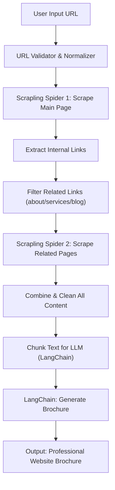

# AI Website Brochure Generator

## 📌 Project Purpose

The purpose of this project is to create an **AI-powered website brochure generator**.  
The system takes a website URL from the user, automatically scrapes its content, discovers related pages, combines all relevant data, and sends it to an AI model (via LangChain) to generate a **professional brochure** summarizing the website's services, offerings, and main content.

This demonstrates **AI engineering skills** including:

- Web scraping & crawling
- Data cleaning & preprocessing
- Multi-page content aggregation
- LLM prompt engineering
- Agent/system workflow design

---

## 🛠️ Packages to Use

| Package | Purpose |
|---------|---------|
| `scrapling` | Full crawling framework, handles multi-page scraping and link discovery |
| `beautifulsoup4` | HTML parsing and extraction |
| `readability-lxml` | Extract main text from HTML cleanly |
| `langchain` | LLM integration for summarization and brochure generation |
| `tldextract` | URL normalization and filtering for same-domain links |
| `playwright` (optional) | Render and scrape JS-heavy websites |

---

## ⚖️ Comparison of Scraping Packages

| Package | Pros | Cons | Best Use Case |
|---------|------|------|---------------|
| **BeautifulSoup4** | Lightweight, easy, deterministic | Not for JS-heavy pages | Static HTML extraction |
| **Scrapling** | Full crawling, async, spider framework, link discovery | Slightly more setup | Multi-page scraping, internal link traversal |
| **Playwright** | Handles JS-heavy pages, headless browser | Slower, heavier | Modern websites with dynamic content |
| **Requests + BS4** | Simple and fast | No crawling built-in | Quick static pages |
| **newspaper3k / trafilatura** | Auto extract main articles | Limited to blogs/articles | News/blog summarization |

> ✅ Recommendation: Use **Scrapling** for crawling multiple pages and discovering related links. Combine with **BeautifulSoup4 + readability-lxml** to clean the content before sending to LangChain.

---

## 🔄 System Flow Diagram (Mermaid)

## 🧩 Step-by-Step Flow

### 1. User Input
- User submits a website URL.

### 2. Scrapling Spider 1
- Scrapes the main page.
- Extracts all internal links.

### 3. Filter Related Links
- Keep only relevant links (about, services, products, blog).
- Can use URL patterns or headings.

### 4. Scrapling Spider 2
- Scrape content from selected related links.
- Collect all meaningful text.

### 5. Combine & Clean
- Merge main + related pages content.
- Remove navigation, footer, ads, scripts.

### 6. Chunk & Send to AI
- Split large text into chunks (LangChain `TextSplitter`).
- Send chunks to LLM with a brochure generation prompt.

### 7. AI Brochure Output
- Receive professional, concise brochure summarizing website content.